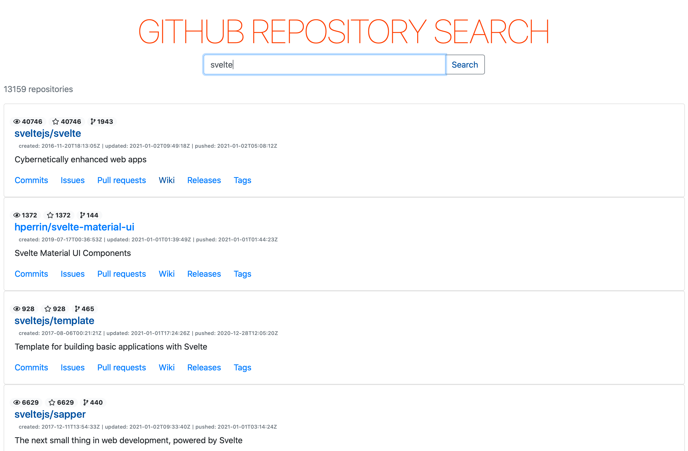

# svelte3-single-page-application

このリポジトリーは、技術書典10「[いまからはじめる Svelte3](https://techbookfest.org/product/4925576424980480?productVariantID=5094401858600960)」付録のサンプルコードです。

* サイト全体にCSSを適用する
* Web APIを使う
* コンポーネントにアクションを取り付ける
* Lintツールで静的解析する



## サンプルコードの試しかた

リポジトリーをクローンしたら、npmパッケージをインストールします。

```bash
cd svelte-app
npm install
```

そして、Rollupのモジュール・バンドル処理を実行し...

```bash
npm run dev
```

ウェブブラウザーで[localhost:5000](http://localhost:5000)にアクセスします。

## 開発環境

* [Svelte](https://svelte.dev) v3.0
* [svelte-check](https://www.npmjs.com/package/svelte-check) v1.0
* [TypeScript]() v3.9
* [ESLint](https://eslint.org) v7.16
* [Prettier](https://prettier.io) v2.2
* [Jest](https://jestjs.io) v-.-
* [Testing Library](https://testing-library.com) v-.-
* [Rollup](https://rollupjs.org) v2.3
* [Twitter Bootstrap](https://getbootstrap.jp) v4.3
* [FontAwesome](https://fontawesome.com) v5.15

## 開発の進めかた

コードを書き換えたら、Lintツール（svelte-check・ESLint・Prettier）で静的解析します。

```bash
npm run validate
npm run lint
```

もしESLintやPrettierがエラーを報告したら...

```bash
npm run fix
```

エラーを解消できたら、ユニットテスト（Jest・Testing Library）を実行します。

```bash
npm run test
```
